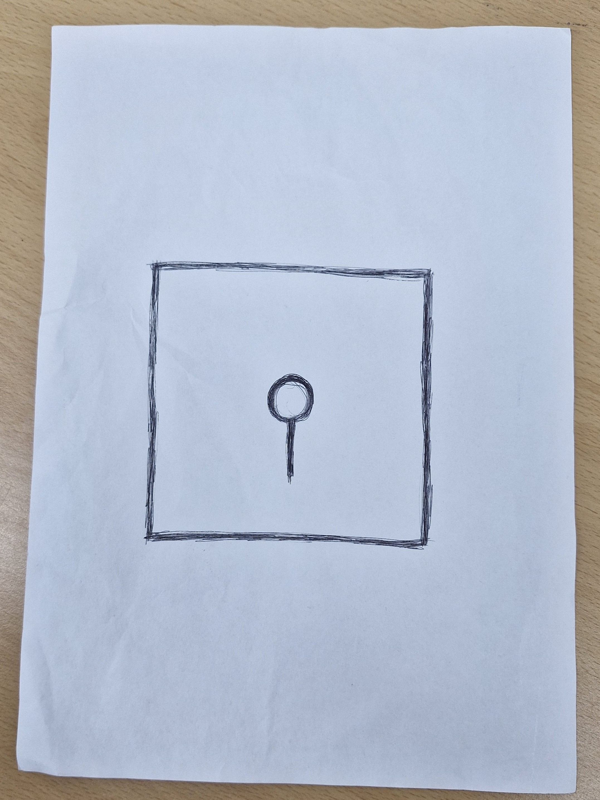
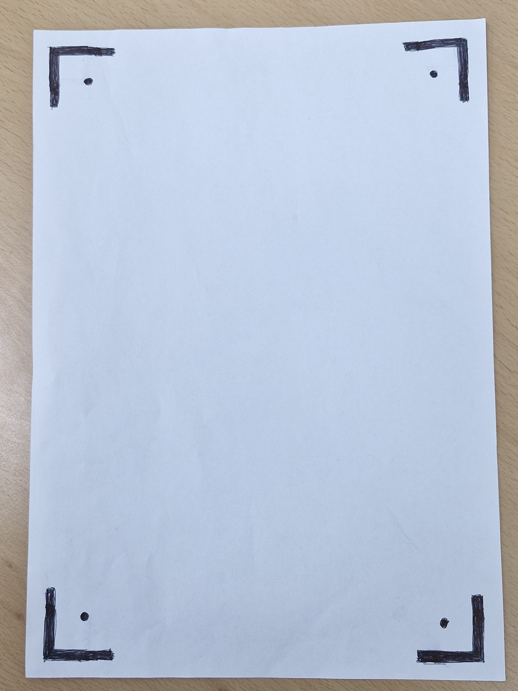
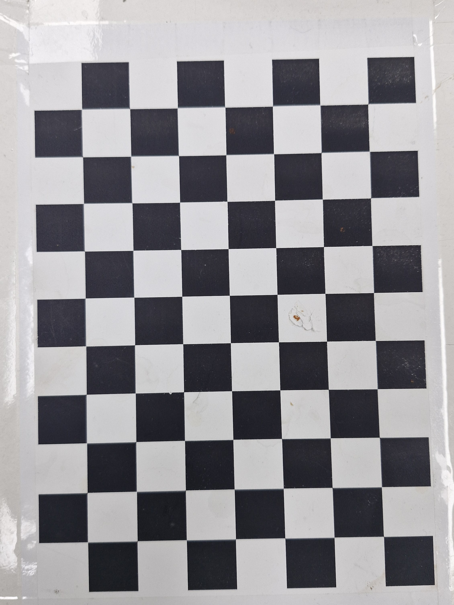

# VisionQuest

**VisionQuest**는 스마트폰 카메라, 손 제스처 인식, 커스텀 마커 기반 AR 보드 추적을 결합한 실시간 AR 던전 전투 게임입니다.  
카메라 입력부터 제스처 분류, 평면 추적, 3D 렌더링, 게임 상호작용까지 하나의 실행 프로그램으로 동작하도록 구성했습니다.

Last updated: 2026-06-07

## 1. Project Overview

VisionQuest의 전체 파이프라인은 다음과 같습니다.

```text
Phone camera
  -> WebSocket JPEG streaming
  -> OpenCV frame loop
  -> MediaPipe hand landmarks
  -> landmark gesture classifier
  -> custom 150 mm gate marker tracking
  -> homography / solvePnP pose estimation
  -> pyrender GLB enemy and ground rendering
  -> AR card battle UI
  -> optional rendered preview back to phone
```

핵심 목표는 **별도 AR 장비 없이 A4 용지 위에 직접 그린 마커를 전장으로 사용하고, 손 제스처만으로 게임을 진행하는 것**입니다.

## 2. Demo / Screenshots

> [문서화 TODO - 스크린샷 첨부 후 이 문단 삭제] 아래 표의 경로에 실제 실행 화면을 저장하고 README에 이미지 링크를 추가하십시오.

| Scene | Recommended Path | Description |
|---|---|---|
| QR setup | `assets/docs/01_qr_setup.png` | PC 화면에 QR과 연결 주소가 표시되는 초기 화면 |
| Connection example | `assets/docs/02_connection_example.png` | PC 와 모바일 기기 연결 예시 |
| Board registration | `assets/docs/03_board_registration.png` | gate marker를 감지하고 `OK_Sign` 홀드로 등록하는 화면 |
| Combat | `assets/docs/04_combat.png` | AR 보드, 적 모델, 플레이어 카드 UI가 함께 보이는 전투 화면 |
| Reward select | `assets/docs/05_reward_select.png` | 웨이브 클리어 후 보상 카드 3장이 표시되는 화면 |
| Defeat restart | `assets/docs/06_defeat_restart.png` | 패배 후 `OK_Sign` 홀드로 게임을 재시작하는 화면 |

### Gameplay Demo Video

> [문서화 TODO - 데모 영상 링크 추가 후 이 문단 삭제] 실제 플레이 데모 영상을 업로드한 뒤 아래 `Demo video` 항목에 링크를 추가하십시오. 영상 파일은 저장소에 직접 넣기보다 YouTube, Google Drive, OneDrive 같은 외부 링크를 사용하는 것을 권장합니다.

- Demo video: `TODO: add gameplay video URL`
- Recommended length: 30-60 seconds
- Suggested flow: QR connection -> phone camera streaming -> gate marker registration with `OK_Sign` -> combat card selection -> simultaneous reveal -> reward selection -> defeat/restart
## 3. Requirements

Python 3.10 기준으로 테스트했습니다.

```bash
pip install -r requirements.txt
```

주요 라이브러리:

- `opencv-python`: frame processing, marker detection, homography, solvePnP
- `mediapipe`: hand landmark detection
- `scikit-learn`: landmark-vector MLP gesture classifier runtime
- `websockets`: phone-to-PC camera streaming
- `qrcode`: QR connection helper
- `trimesh`, `pyrender`, `PyOpenGL`: GLB/GLTF model rendering
- `pygame`: PC-side BGM/SFX playback

필수 런타임 파일:

```text
models/hand_landmarker.task
models/gesture_model.pkl
assets/
```

`main.py`는 TensorFlow DLL 문제를 피하기 위해 기본적으로 `.pkl` gesture model을 사용합니다. CNN/학습용 `.keras` 파일과 raw dataset은 재학습용이며 최종 실행에는 필수는 아닙니다.

## 4. How To Run

```bash
python main.py
```

실행하면 `main.py`가 HTTP 서버와 WebSocket 서버를 함께 시작합니다.

```text
HTTP camera page: http://<PC_IP>:8000/?ws_port=8765
WebSocket frames: ws://<PC_IP>:8765
```

실제 사용 순서:

1. PC와 스마트폰을 같은 네트워크에 연결합니다.
2. PC에서 `python main.py`를 실행합니다.
3. PC 화면에 표시되는 QR 코드를 스마트폰으로 스캔합니다.
4. 스마트폰 브라우저에서 카메라 권한을 허용합니다.
5. A4 용지 위에 그린 150 mm gate marker를 카메라에 비춥니다.
6. `OK_Sign`을 2초간 유지하면 보드가 등록되고 게임이 시작됩니다.
7. 전투 중에는 `Fist`, `Open_Palm`, `V_Sign` 또는 `Gun_Sign`을 2초간 유지해 카드를 선택합니다.
8. 패배 후에는 `OK_Sign`을 2초간 유지해 보드 등록은 유지한 채 게임만 재시작합니다.

키보드 입력은 디버깅/종료용입니다.

```text
Q      quit program
R      hard reset, including board registration
D      toggle debug overlays
```

일반 플레이 흐름은 스마트폰 카메라와 손 제스처만으로 진행되도록 설계했습니다.
### Chrome HTTP Camera Permission Troubleshooting

VisionQuest는 시연 편의성을 위해 LAN 내부 HTTP 페이지(`http://<PC_IP>:8000`)에서 스마트폰 카메라를 사용합니다. 최신 브라우저는 `getUserMedia` 같은 camera API를 기본적으로 HTTPS secure origin에서만 허용하므로, HTTPS/WSS를 구성하지 않은 환경에서는 카메라 권한을 허용해도 브라우저가 카메라를 차단할 수 있습니다.

Chrome에서 LAN HTTP 주소를 임시로 secure origin처럼 취급하려면 다음 절차를 사용합니다.

> [문서화 TODO - 스크린샷 첨부 후 이 문단 삭제] 아래 위치에 `chrome://flags` 화면의 스크린샷을 추가하십시오.  
> `assets/docs/07_chrome_flags_insecure_origin.png`


1. 스마트폰 Chrome 주소창에 `chrome://flags/#unsafely-treat-insecure-origin-as-secure`를 입력합니다.
2. `Insecure origins treated as secure` 항목을 찾습니다.
3. 입력 칸에 PC 실행 화면의 origin을 정확히 입력합니다. 예: `http://192.168.0.10:8000`
4. 해당 flag를 `Enabled`로 변경합니다.
5. Chrome을 relaunch하거나 완전히 종료 후 다시 실행합니다.
6. 다시 QR URL에 접속하고 카메라 권한을 허용합니다.

주의: 이 설정은 로컬 개발용 임시 우회입니다. 신뢰할 수 없는 주소를 추가하지 말고, 시연이 끝나면 해당 flag를 원래 상태로 되돌리는 것이 좋습니다.

## 5. Marker Design

기본 마커는 A4 용지 중앙에 직접 그리는 **single gate marker**입니다. 마커 자체가 게임 보드입니다.

권장 치수:

- 검은색 속 빈 정사각형: 약 `15 cm x 15 cm`
- 중앙의 속 빈 원 또는 링
- 중앙 원에서 아래 방향으로 내려오는 짧은 직선
- 직선은 아래 테두리에 닿지 않고 중간에서 끝나야 합니다.

### Why This Marker Became the Main Method

개발 초기에는 A4 네 모서리에 작은 L 표식을 그리는 방식과 체스보드 패턴을 모두 검토했습니다. 최종적으로는 하나의 큰 gate marker를 기본 방식으로 선택했습니다.

| Method | Strength | Problem in This Project |
|---|---|---|
| Four L-corner markers | A4 전체를 보드로 쓸 수 있고 각 코너가 직접적인 평면 기준점이 됨 | 각 L 표식이 작아 조명, 손가림, 볼펜 굵기, 배경 노이즈에 민감했습니다. 네 표식을 모두 slot에 올바르게 배정해야 하므로 오검출 하나가 전체 homography를 흔들었습니다. L의 열린 방향 추정도 원근 왜곡과 손그림 품질에 따라 불안정했습니다. 현재는 legacy 비교 경로로만 보존합니다. |
| Chessboard marker | 많은 코너를 제공하므로 정밀 calibration/pose estimation에 유리함 | 게임 보드가 체스보드처럼 보여 던전/마법진 콘셉트와 맞지 않습니다. 또한 내부 격자 전체에서 다수 코너를 찾고 정렬해야 하므로 시연 중 프레임 비용이 커지고, 휴대폰 스트리밍 + 손 인식 + 3D 렌더링을 동시에 수행하는 현재 구조에서는 부담이 큽니다. 선택 옵션으로는 남길 수 있지만 기본값으로 쓰지 않습니다. |
| Single gate marker | 큰 외곽 사각형으로 4개 코너를 안정적으로 얻고, 내부 링과 stem으로 오검출과 방향 모호성을 줄임 | A4 전체가 아니라 150 mm 정사각 마커 영역을 보드로 사용해야 합니다. 대신 연산량이 낮고 손으로 그리기 쉬우며 게임 분위기에 가장 잘 맞습니다. |

### Marker Comparison Photos

> [문서화 TODO - 실제 비교 사진 첨부 후 이 문단 삭제] 아래 세 이미지를 같은 카메라 거리, 같은 조명, 비슷한 종이 크기로 촬영해 넣으면 gate marker 선택 이유가 더 직관적으로 전달됩니다.

| Photo | Recommended Path | What It Should Show |
|---|---|---|
| Current single gate marker | `assets/docs/marker_01_gate_marker.jpg` | 150 mm 정사각 외곽, 중앙 링, 짧은 stem이 한 장의 보드 마커로 동작하는 모습 |
| Legacy four L markers | `assets/docs/marker_02_legacy_l_markers.jpg` | A4 네 모서리의 작은 L 표식과, 조명/손가림/slot 배정에 민감했던 구조 |
| Chessboard option | `assets/docs/marker_03_chessboard_marker.jpg` | 많은 코너를 제공하지만 게임 분위기와 연산 비용 측면에서 기본값으로 쓰지 않은 대안 |

사진을 추가한 뒤에는 아래처럼 실제 이미지를 README에 직접 표시할 수 있습니다.

```markdown



```

STag 계열의 fiducial marker 연구는 안정적인 마커가 단순한 코너뿐 아니라 **명확한 외곽 구조**, **내부 검증 패턴**, **방향 또는 ID 모호성 제거**, **검출 confidence 평가**를 함께 가져야 한다는 점을 보여줍니다. VisionQuest의 gate marker는 이 아이디어를 손그림 가능한 형태로 단순화했습니다.

- 외곽 속 빈 정사각형: 네 코너와 projective transform의 기준을 제공합니다.
- 중앙 링: 일반 사각형, 책상 모서리, 그림자 같은 후보를 reject하는 내부 검증 패턴입니다.
- 짧은 stem: 마커의 아래 방향을 알려 주어 90도/180도 회전 모호성을 줄입니다.
- 단일 큰 마커: 작은 L 표식 네 개보다 후보 수와 slot 조합 수가 적어 계산량이 낮습니다.

따라서 현재 마커는 L 표식보다 안정적이고, 체스보드보다 몰입도를 해치지 않으며, 실시간 게임 루프에서 감당 가능한 연산 비용을 가지는 절충안입니다.

## 6. Computer Vision Techniques

### Phone Camera Streaming

스마트폰은 브라우저에서 카메라 프레임을 JPEG로 압축해 WebSocket으로 PC에 전송합니다. PC는 최신 프레임만 처리해 stale frame 누적을 줄이고, 렌더링된 결과 프레임을 다시 휴대폰으로 전송할 수 있습니다.

### Gesture Recognition

MediaPipe hand landmark를 사용해 손의 3D landmark vector를 추출하고, 학습된 MLP classifier로 제스처를 분류합니다.

```text
Fist       -> Strike
Open_Palm  -> Guard
V_Sign     -> Shot
Gun_Sign   -> Shot
OK_Sign    -> setup / restart
```

`V_Sign`과 `Gun_Sign`은 학습 시 별도 클래스로 두어 정확도를 높이고, 게임에서는 같은 `Shot` 카드로 매핑합니다. 오인식을 줄이기 위해 top probability와 class margin을 함께 검사하며, 특히 `Shot` 계열은 더 엄격한 threshold를 사용합니다.

독립 테스트:

```bash
python models/test_gesture_model.py
```

### Gate Marker Tracking

마커 추적은 STag 및 planar fiducial marker 연구에서 사용되는 안정적인 코너 검출, 보조 심볼 검증, confidence 기반 추적 아이디어를 참고했습니다. 단, 실제 구현은 손으로 그릴 수 있는 단일 gate marker에 맞게 직접 구성했습니다.

```text
dark contour / edge candidate
  -> quadrilateral validation
  -> canonical perspective patch
  -> border continuity validation
  -> central ring validation
  -> stem orientation validation
  -> homography and confidence score
  -> solvePnP pose
  -> optical-flow tracking and periodic re-detection
```

주요 안정화 기법:

- downscaled frame detection으로 초기 검출 비용 감소
- normalized marker patch에서 외곽, 링, stem을 검증
- confidence score와 EMA smoothing으로 흔들림 완화
- LK optical flow와 RANSAC homography로 등록 후 추적 유지
- 스마트폰 회전 등 해상도 변경 시 tracking cache reset
- debug mode에서만 후보/진단 overlay 표시

### AR Rendering

2D 바닥은 homography로 보드 평면에 맞추고, 3D 적 모델은 `solvePnP` pose를 기반으로 `pyrender`에서 RGBA frame으로 렌더링한 뒤 OpenCV frame에 alpha blending합니다.

```text
board corners
  -> homography for board-space UI
  -> solvePnP rvec/tvec
  -> pyrender offscreen rendering
  -> OpenCV alpha blend
```

모델 포맷:

- 권장: `.glb` in `assets/models/`
- `.obj`는 이전 fallback 용도로만 유지 가능

좌표 변환:

```text
game_x = asset_x
game_y = asset_z
game_z = asset_y
```

일반적인 Y-up GLB asset을 보드 기준 Z-up 좌표계로 맞추기 위한 변환입니다. 개별 모델의 정면 방향은 asset마다 다를 수 있어 필요 시 타입별 보정값을 둘 수 있습니다.

## 7. Game System

게임은 무한 웨이브 방식의 던전 전투입니다.

```text
camera setup
  -> OK hold board registration/start
  -> wave intro
  -> player card hold
  -> simultaneous reveal
  -> round resolution
  -> wave clear
  -> reward select
  -> next wave
  -> defeat
  -> OK hold restart
```

전투는 플레이어와 적이 카드를 동시에 공개하는 구조입니다.

| Player Card | Gesture | Meaning |
|---|---|---|
| Strike | `Fist` | 기본 공격 |
| Guard | `Open_Palm` | 회복/방어 계열 선택 |
| Shot | `V_Sign` or `Gun_Sign` | 고위험 고화력 스킬 |

플레이어 기본 스탯:

```text
Max HP: 100
Attack power: 15
Strike damage: attack_power + strike_bonus
Shot damage: (attack_power + shot_bonus) * 2
Guard heal: max(5, missing_hp * (10% + guard ratio bonus)) + flat bonus
```

난이도:

```text
Wave N multiplier = 1.15 ** (N - 1)
```

적 HP와 공격력은 웨이브 배율을 적용해 증가합니다.

## 8. Rewards and Augments

웨이브 클리어 후 3장의 보상 카드가 등장합니다. 보상 선택은 기존 제스처 카드 UX를 재사용하며, 잘못 선택되지 않도록 hold 기반으로 확정합니다.

보상 카테고리:

- `stat`
- `heal`
- `card_upgrade`
- `augment`

기본 보상 예시:

- 최대 체력 증가
- 공격력 증가
- 전체 피해 배율 증가
- Strike 피해 증가
- Guard 회복량 증가
- Shot 피해 증가

구현된 augment:

- Double Attack
- Cull the Weak
- Deep Rest
- Counter Guard
- Chicken Game
- Vampire
- Prepared
- Insurance
- First Strike

이미 획득한 augment는 이후 보상 풀에서 제외됩니다.

## 9. PC Audio

PC-side audio는 `pygame.mixer` 기반의 `audio/AudioManager`가 담당합니다. 오디오 파일이 없거나 `pygame` 초기화가 실패해도 게임은 계속 실행됩니다.

지원 구조:

```text
assets/audio/bgm/dungeon_*.mp3
assets/audio/bgm/setup_*.mp3
assets/audio/sfx/*.wav
```

BGM은 같은 카테고리의 여러 파일 중 하나를 랜덤으로 재생할 수 있습니다. SFX는 카드 포커스, 카드 확정, 공격, 방어, 피격, 보상, 증강 발동, 패배 등 게임 이벤트에 연결됩니다.

자세한 트리거 목록은 `assets/audio/README.md`를 참고하십시오.

## 10. Project Structure

```text
ar/                 marker tracking, homography, AR rendering
audio/              PC BGM/SFX manager
assets/             cards, GLB models, audio assets
game/               battle, wave, reward, augment, player/enemy state
models/             runtime gesture model and training scripts
network/            HTTP/WebSocket camera server and frame receiver
ui/                 AR-space cards, HUD, floating text
vision/             hand tracking, gesture feature extraction, dataset tools
web/                phone camera web page
main.py             main runtime loop
```

## 11. Training and Dataset Notes

최종 실행에는 raw dataset이 필요하지 않습니다.

데이터 수집/학습 관련 도구:

```text
vision/dataset_capture_both.py
vision/dataset_capture_cnn.py
models/train_landmarks.py
models/train_cnn.py
models/train.py
```

공개 배포용 archive에서는 `dataset/`, `dataset_landmarks/`를 제외합니다. 모델을 재학습해야 하는 경우 별도 저장소 또는 Google Drive 링크로 데이터셋을 제공할 수 있습니다.

## 12. References and Credits

라이브러리:

- OpenCV: image processing, contour analysis, homography, solvePnP, optical flow
- MediaPipe: hand landmark detection
- scikit-learn: MLP gesture classifier runtime
- trimesh / pyrender / PyOpenGL: GLB/GLTF model loading and offscreen rendering
- pygame: PC-side audio playback

참고 아이디어:

- STag: A Stable Fiducial Marker System
  - https://arxiv.org/abs/1707.06292
  - 외곽 사각형을 검출과 homography estimation에 사용하고, 내부 원형 구조를 refinement에 활용하는 설계에서 gate marker의 외곽 프레임 + 중앙 링 검증 아이디어를 참고했습니다.
- Planar Fiducial Markers: A Comparative Study
  - https://www.researchgate.net/publication/368687738_Planar_fiducial_markers_a_comparative_study
  - marker system을 sensitivity, specificity, accuracy, computational cost, occlusion 관점에서 비교하는 접근을 참고해 L 표식, 체스보드, single gate marker의 장단점을 정리했습니다.
- Designing Highly Reliable Fiducial Markers
- Fiducial Markers for Pose Estimation: Overview and Comparison
- Chromium security documentation: Deprecating Powerful Features on Insecure Origins (`getUserMedia` secure-origin restriction and `chrome://flags/#unsafely-treat-insecure-origin-as-secure` workaround)
  - https://www.chromium.org/Home/chromium-security/deprecating-powerful-features-on-insecure-origins/

에셋:

- 현재 포함된 PNG, GLB, 오디오 에셋은 CC0 또는 자체 제작 에셋만 사용하는 asset policy를 따릅니다.
- 자세한 기록은 `assets/ASSET_LICENSES.md`를 참고하십시오.

## 13. Known Limitations

- HTTPS/WSS는 구현하지 않았습니다. 같은 LAN에서 HTTP camera page를 사용하는 구조입니다.
- 카메라 intrinsic calibration은 근사값을 사용합니다.
- `pyrender`는 로컬 OpenGL/offscreen rendering 환경에 의존합니다.
- GLB animation clip 재생은 아직 지원하지 않습니다.
- raw dataset은 공개 배포용 archive에서 제외됩니다.
- 실제 인식 성능은 조명, 마커 선명도, 손 제스처 데이터 균형에 영향을 받습니다.

## 14. Verification and Packaging

정적 검증:

```bash
python -m py_compile main.py ar/*.py game/*.py ui/*.py vision/*.py network/*.py models/*.py audio/*.py
```

수동 실행 검증:

1. `python main.py` 실행
2. QR 접속 및 스마트폰 카메라 프레임 수신 확인
3. gate marker 등록과 `OK_Sign` 2초 시작 확인
4. 전투 카드 선택, 보상 선택, defeat restart 확인
5. BGM/SFX 재생 확인

배포 archive 정책:

- 포함: source code, `models/hand_landmarker.task`, `models/gesture_model.pkl`, `assets/`, `requirements.txt`, `README.md`, `LICENSE`
- 제외: `.git/`, `dataset/`, `dataset_landmarks/`, `__pycache__/`, `*.pyc`, generated QR images, local zip files
- 생성된 archive 예시: `VisionQuest_submission_20260607.zip`

공유 또는 재현용으로는 Repository URL과 source archive를 함께 제공하는 방식을 권장합니다.
## 15. Executable Build Policy

기본 release archive에는 Windows exe 배포 폴더를 포함하지 않습니다. 기본 실행 방식은 `python main.py` 기준으로 안내합니다.

PyInstaller exe는 MediaPipe, OpenGL, pyrender, scikit-learn 등 숨은 의존성이 많아 평가 환경에 따라 누락 모듈이나 렌더링 문제가 발생할 수 있습니다. 따라서 exe는 검증된 별도 보조 배포가 필요할 때만 선택적으로 생성합니다.

보조 exe가 필요한 경우 권장 방식은 PyInstaller `onedir` 빌드입니다. `onefile`은 실행 시 대용량 라이브러리와 assets를 임시 폴더로 풀어야 해서 시작이 느리고, 의존성 문제를 디버깅하기 어렵습니다.

예시 명령:

```powershell
pyinstaller --noconfirm --onedir --windowed --name VisionQuest `
  --add-data "assets;assets" `
  --add-data "models;models" `
  --add-data "web;web" `
  --collect-all mediapipe `
  --collect-all sklearn `
  --collect-all pyrender `
  --collect-all trimesh `
  --collect-all OpenGL `
  main.py
```

빌드 결과는 `dist/VisionQuest/VisionQuest.exe` 형태로 생성됩니다. 이 폴더는 기본 source archive에서 제외합니다.

주의 사항:

- exe 배포본은 source zip보다 훨씬 커질 수 있습니다.
- 대상 PC에 OpenGL/offscreen rendering 환경이 맞지 않으면 pyrender가 실패할 수 있습니다.
- 기본 배포와 재현성 검증은 Python source 실행을 기준으로 합니다.
